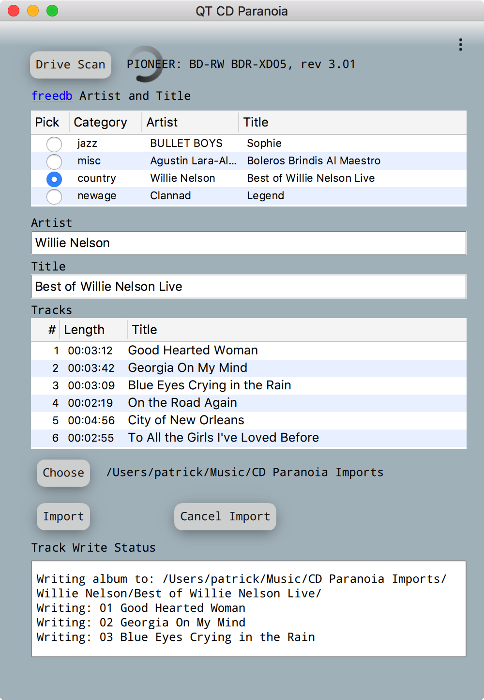

A Qt5 GUI for CD Paranoia
-------------------------  

[Cdparanoia](https://xiph.org/paranoia/) extracts audio from compact discs directly as data. This
project provides a simple GUI for some of it's functions. It also makes use of
[GNU's libcdio](https://www.gnu.org/software/libcdio/libcdio.html) and
[libcddb](http://libcddb.sourceforge.net/) a C library for accessing artist, album, and track data
on [freedb.org](http://www.freedb.org/)

The GUI provides the ability to scan a CD and retrieve the related data from freedb.org. Since 
the disc ID may match multiple categories all available results are listed. The user then chooses 
the desired one from the list. This populates a form with editable fields for artist, album 
title, and track titles. The user can edit the fields before importing the music to a selected 
folder. The music is imported in WAV format.

Please be aware that I am somewhat new to C++ and this is my first Qt project. I
created this application to learn about Qt and multi-threaded device driver programming in C++.
If you're in need of a lossless CD importer there are many professional options to choose from.
If you're a interested in learning as I am I hope you find this project instructive.

Patrick Moffitt  
November 19, 2017
  
  
